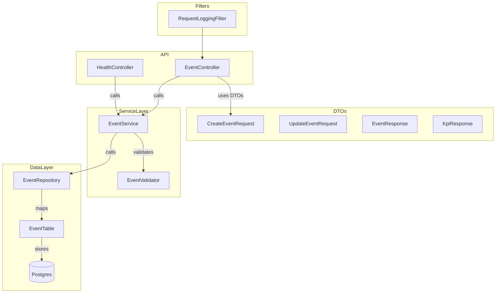

# StreamForge

StreamForge is a small event-tracking backend built with Play Framework and Scala. It stores events in PostgreSQL and exposes a simple HTTP API and a tiny frontend at the project `public/` directory.

**This update**: clarifies configuration, run/migration steps, and quick developer notes to get contributors up and running.

**Tech stack**

- Scala 2.13.18
- Play Framework (Play Scala)
- Slick + Play-Slick (database access)
- PostgreSQL
- Flyway (DB migrations)
- SBT (build tool)

**Project layout (important files)**

 - `app/controllers/` — HTTP controllers (request/response handling)
 - `app/services/` — business logic (`EventService`)
 - `app/repositories/` — Slick queries (`EventRepository`)
 - `app/tables/` — Slick table mappings (`EventTable`)
 - `app/models/` — domain models (`Event`)
 - `app/dto/` — request/response DTOs
 - `app/validator/` — business validation (`EventValidator`)
 - `app/modules/` — startup wiring (`FlywayModule`, `FlywayMigrationRunner`)
 - `conf/application.conf` — main configuration (DB, Flyway, Play)
 - `conf/routes` — HTTP routes
 - `conf/db/migration/` — Flyway SQL migrations
 - `public/` — minimal frontend (index.html, app.js, style.css)

**High-level request flow**

- Controller validates JSON and maps to domain model (e.g. `POST /api/events`).
- Service (`EventService`) enforces business rules via `EventValidator`.
- Repository (`EventRepository`) performs CRUD using Slick against the `events` table.

**Architecture**

The project follows a layered architecture with clear separation of concerns. The diagram below shows the primary components and the typical call flow from HTTP to the database.



Key file mappings (examples):

- Presentation / Controllers: [app/controllers/EventController.scala](app/controllers/EventController.scala), [app/controllers/HealthController.scala](app/controllers/HealthController.scala)
- Filters: [app/filters/RequestLoggingFilter.scala](app/filters/RequestLoggingFilter.scala)
- Service / Business logic: [app/services/EventService.scala](app/services/EventService.scala)
- Validation: [app/validator/EventValidator.scala](app/validator/EventValidator.scala)
- Repository / Data access: [app/repositories/EventRepository.scala](app/repositories/EventRepository.scala)
- Persistence mapping: [app/tables/EventTable.scala](app/tables/EventTable.scala)
- Domain model: [app/models/Event.scala](app/models/Event.scala)
- DTOs: [app/dto/CreateEventRequest.scala](app/dto/CreateEventRequest.scala), [app/dto/EventResponse.scala](app/dto/EventResponse.scala), [app/dto/KpiResponse.scala](app/dto/KpiResponse.scala)

This diagram and mapping should help contributors quickly identify where to add new features or tests while preserving separation of concerns.

**Prerequisites**

- JDK 17+
- SBT
- PostgreSQL (local or remote)

**Configuration**

The app uses Slick for runtime DB access and Flyway for migrations. Check `conf/application.conf` for current defaults (the project uses a local DB URL by default):

- `slick.dbs.default.db.url` — JDBC URL (default: `jdbc:postgresql://localhost:5432/streamforge`)
- `slick.dbs.default.db.user` — DB user
- `slick.dbs.default.db.password` — DB password
- Flyway reads `flyway.url`, `flyway.user`, `flyway.password` which are wired to the Slick values in the same file.

To change DB connection settings, edit [conf/application.conf](conf/application.conf#L1).

Flyway is configured to run on application startup via `app/modules/FlywayModule.scala` and `app/modules/FlywayMigrationRunner.scala`. To disable automatic migrations, set `flyway.enabled = false` in `conf/application.conf`.

**Database & migrations**

Migrations live in `conf/db/migration/`.

- `V1__create_events_table.sql` — creates the `events` table and indexes.
- `V2__events_created_at_to_timestamptz.sql` — converts `created_at` to TIMESTAMPTZ.

If you prefer to run Flyway manually (outside app startup), you can use the Flyway CLI or configure a separate script; the project already includes Flyway Core as a dependency in `build.sbt`.

**Run locally**

1. Create the DB (example using psql):

```sql
CREATE DATABASE streamforge;
CREATE USER streamforge_user WITH PASSWORD 'yourpassword';
GRANT ALL PRIVILEGES ON DATABASE streamforge TO streamforge_user;
```

2. Update `conf/application.conf` with your DB credentials (or set environment variables and/or an override file).

3. Start the app (migrations run automatically if `flyway.enabled = true`):

```bash
sbt run
```

4. App defaults to http://localhost:9000. To change the port:

```bash
sbt -Dhttp.port=9001 run
```

**Tests**

Run the test suite with:

```bash
sbt test
```

**API (quick reference)**

- `GET /api/health` — health check
- `POST /api/events` — create an event (JSON body)
- `GET /api/events` — list events
- `GET /api/events/:id` — fetch by id
- `PUT /api/events/:id` — update
- `DELETE /api/events/:id` — delete

Example: create event

```bash
curl -X POST http://localhost:9000/api/events \
  -H "Content-Type: application/json" \
  -d '{"userId":1,"amount":450.00,"eventType":"purchase"}'
```

Example: list events

```bash
curl http://localhost:9000/api/events
```

**Validation & error format**

Validation logic lives in `app/validator/EventValidator.scala`. Controller responses return JSON objects with a `message` field for errors (400/404). See `app/controllers/EventController.scala` for examples and HTTP status codes.

**Developer notes / next steps**

- Add unit tests for `EventValidator` and `EventService`.
- Add controller integration tests (use Play's `GuiceOneAppPerSuite` / test helpers).
- Add query filters and pagination to the repository and controller.
- Consider adding a Dockerfile / docker-compose for local DB + app wiring.

If you want, I can also:

- add a `docker-compose.yml` to run Postgres + app
- add a simple `Makefile` with common commands
- scaffold unit test examples for `EventValidator`

---
Updated README to make onboarding and local development quicker.